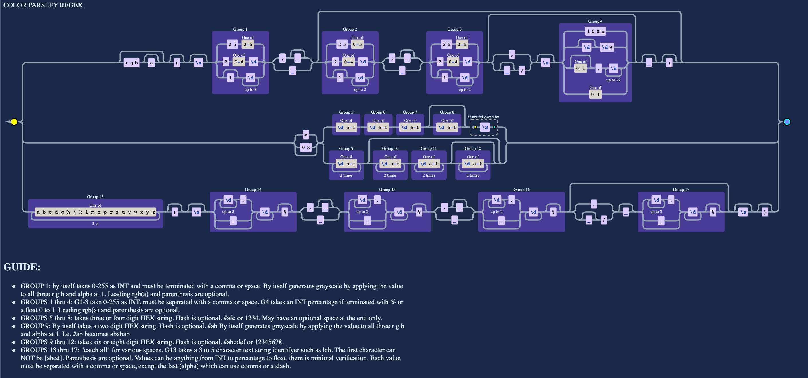

<p align="center">

  <a href="https://npmjs.org/package/colorparsley">
    
  </a> &nbsp;&nbsp;
  <a href="https://github.com/Myndex/colorparsley/src/">
    
  </a> &nbsp;&nbsp;
  <a href="https://github.com/Myndex/colorparsley/blob/master/LICENSE.md">
    
  </a> &nbsp;&nbsp;
</p>
<p align="center">
  <a href="https://github.com/Myndex/colorparsley">
    
  </a> &nbsp;&nbsp;
  <a href="https://npmjs.org/package/colorparsley">
    
  </a> &nbsp;&nbsp;
  <a href="https://twitter.com/MyndexResearch">
    
  </a> &nbsp;&nbsp;
</p>

# CoLoR🎨 PaRsLeY🌿
## colorParsley()

### A small color parsing utility with no dependencies

[Current Version:](./docs/versionHistory.md) **0.0.2**

ColoR PaRsLeY is a spin off of the SAPC/APCA project. It is a lightweight but powerful tool for parsing color values out of various string types. It supports HEX, RGB INT, HTML & CSS Named Colors, and a variety of additional color models.

ColoR PaRsLeY returns a simple four element array of RGBA INT for HEX or RGB INT inputs, but longer arrays are available for the specialty category. 

## QuickStart

### *Usage:*
"colorParsley()" send it a string, it returns an rgba INT array:

```javascript
    let textColor = colorParsley('#111111');
    let backgroundColor = colorParsley('rgb(123,23,233,1.0)');

    console.log(textColor); // [17,17,17,1.0]
    console.log(backgroundColor); // [123,23,233,1.0]
```````

The following are the available input types for colorParsley(), HSL is not implemented at the moment. All are automatically recognized:

### INPUT as STRINGS:
- **No Alpha**
    - ` '#abc' ` or ` 'abc' ` (interpreted as ` 'aabbcc' `)
    - ` '#abcdef' ` or ` 'abcdef' ` (hash is ignored)
    - ` 'rgb(123, 45, 67)' ` or ` '123,45,67' `
    - ` 'aquamarine' ` or ` 'magenta' ` (full CSS4 named colors list)
- **With Alpha**
    - ` '#abcf' ` or ` 'abcf' ` (interpreted as ` 'aabbccff' `)
    - ` '#123456ff' ` or ` '123456ff' ` (hash is ignored)
    - ` 'rgba(123, 45, 67,1.0)' `

### NEW:
- Greyscale shortcuts!
    - For HEX, just two digits: a7 means `#a7a7a7`
    - For INT, 1-3 digits followed by a comma: 123, means `rgb(123,123,123)`
- Better regex validation for rgb INTs
    - Each RGB value must be 0-255. Alpha is 0-1 or 0% to 100%
    - Alpha values with percent symbol are converted to 0.0-1.0
- New regex parsing for lch, hsv, etc.
    - first 3-5 characters defines the color type
    - minimal verification and maximum flexibility for different color space and color model types.
    - Supports INT, float, and percentage with % symbol.
    - All values with percent symbol are converted to 0.0-1.0
    - NOTE: at this time, these are not processed into an rgba array and
    - other than percentage, values are left as is, and
    - the color type is returned as the fifth element in the array

### Sending as a NUMBER:
- **As hex**
    - ` 0xabcdef `
- **As integer**
    - ` 11259375 `

No alpha parsing for _numbers_ in part as there are big and little endian issues that need to be resolved.

### RETURNS
- All hex and rgb() inputs return a 4 element rgba 8bit INT array `[255,255,255,1.0]`
- 4 element arrays are always assumed to be sRGB
- A value input with a percentage symbol % is divided by 100.0
- All values are assumed to be 8bit unless a decimal point is found.

- An optional 5th array element is colorspace or model (i.e. hsl) (default sRGB)
    - `[255,255,255,1.0,'sRGB']`

#### Future
- An optional 6th array element is the gamma or TRC (default sRGB or per table)
    - `[322,0.7,0.5,1.0,'hsv',2.2]`
- An optional 7th array element is the whitepoint (default D65)
    - `[123,123,123,1.0,'ProPhoto','1.8','D50']`
- An optional 8th array element is the bitdepth (default 8bit per channel)
    - `[0.95,1.1,0.76,1.0,'RGB','1.0','D65', 32]`

### The NEW CoLoR PaRsLeY REGEX:




