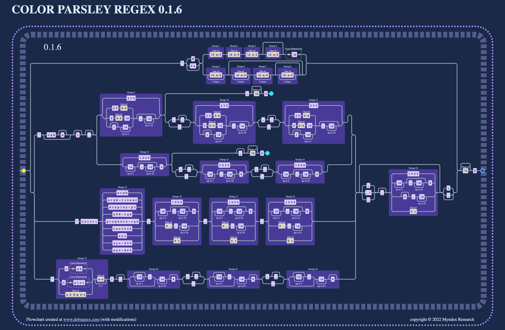

<p align="center">

  <a href="https://npmjs.org/package/colorparsley">
    
  </a> &nbsp;&nbsp;
  <a href="https://github.com/Myndex/colorparsley/src/">
    
  </a> &nbsp;&nbsp;
  <a href="https://github.com/Myndex/colorparsley/blob/master/LICENSE.md">
    
  </a> &nbsp;&nbsp;
</p>
<p align="center">
  <a href="https://github.com/Myndex/colorparsley">
    
  </a> &nbsp;&nbsp;
  <a href="https://npmjs.org/package/colorparsley">
    
  </a> &nbsp;&nbsp;
  <a href="https://twitter.com/MyndexResearch">
    
  </a> &nbsp;&nbsp;
</p>

# CoLoR🎨 PaRsLeY🌿


## colorParsley()

### A lightweight but versatile color parsing utility with no dependencies

[Current Version:](./docs/versionHistory.md) **0.1.1**

ColoR PaRsLeY is a spin off of the SAPC/APCA project. It is a lightweight but powerful tool for parsing color values out of various string types. It supports HEX, RGB INT, HTML & CSS Named Colors, and a variety of additional color models.

ColoR PaRsLeY returns a simple four element array of RGBA INT for HEX or RGB INT inputs, but longer arrays are available for the specialty category. 

## QuickStart

### *Usage:*
"colorParsley()" send it a string, it returns an rgba INT array:

```javascript
    let textColor = colorParsley('#111111');
    let backgroundColor = colorParsley('rgb(123,23,233,1.0)');

    console.log(textColor); // [17,17,17,1.0,true,'sRGB']
    console.log(backgroundColor); // [123,23,233,1.0,true,'sRGB']
    
    // STRUCTURE
    returnedArray = [Rint,Gint,Bint,Afloat,isValidBool,colorspaceString]
```

The following are the available input types for colorParsley(). **All are automatically recognized:**

### INPUT as STRINGS:
- **No Alpha**
    - ` '#abc' ` or ` 'abc' ` (interpreted as ` 'aabbcc' `)
    - ` '#abcdef' ` or ` 'abcdef' ` (hash is ignored)
    - ` 'rgb(123, 45, 67)' ` or ` '123,45,67' `
    - ` 'aquamarine' ` or ` 'magenta' ` (full CSS4 named colors list)
- **With Alpha**
    - ` '#abcf' ` or ` 'abcf' ` (interpreted as ` 'aabbccff' `)
    - ` '#123456ff' ` or ` '123456ff' ` (hash is ignored)
    - ` 'rgba(123, 45, 67,1.0)' `

### NEW:

- HSL and HWB now!
    - hsl(310,40%,60%, 1.0) (alpha optional)
- NEW export utilities for hex and rgb strings
    - colorToHex(colorParsley('rgb(170,187,204)')) returns 'abc'
    - colorToRGB(colorParsley('abc')) returns 'rgb(170,187,204)'
- Better error handling—now errors return [0,0,0,'',false,'&lt;error message&gt;']
- Send it an object containing {r: g: b:} or {red: green: blue:}
- Send it a simple array [r,g,b,a]
- Greyscale shortcuts!
    - For HEX, just two digits: a7 means `#a7a7a7`
    - For INT, 1-3 digits followed by a comma: 123, means `rgb(123,123,123)`
- "More better" regex validations and input type steering
    - Each RGB value must be 0-255. Alpha is 0-1 or 0% to 100%
    - Alpha values with percent symbol are converted to 0.0-1.0
- regex parsing for lch, hsv, etc.
    - first 3-5 characters defines the color type
    - minimal verification and maximum flexibility for different color space and color model types.
    - Supports INT, float, and percentage with % symbol.
    - All values with percent symbol are converted to 0.0-1.0
    - NOTE: at this time, these are not processed into an rgba array and
    - other than percentage, values are left as is, and
    - the color type is returned as the fifth element in the array

### Sending as a NUMBER:
- **As hex**
    - ` 0xabcdef `
- **As integer**
    - ` 11259375 `

No alpha parsing for _numbers_

### RETURNS
- All hex and rgb() inputs return a 6 element rgba 8bit INT array
    - `[255,255,255,1.0,true,'sRGB']`
- A value input with a percentage symbol % is divided by 100.0
- Values are assumed to be 8bit unless a decimal point is found.

- The "isValid" boolean is the 5th element in the return array.
- The 6th array element is colorspace or model (i.e. hsl) (default sRGB)
    - `[255,255,255,1.0,true,'sRGB']`

### Future
- An optional 7th array element is the gamma or TRC (default sRGB or per table)
    - `[322,0.7,0.5,1.0,'hsv',2.2]`
- An optional 8th array element is the whitepoint (default D65)
    - `[123,123,123,1.0,'ProPhoto','1.8','D50']`
- An optional 9th array element is the bitdepth (default 8bit per channel)
    - `[0.95,1.1,0.76,1.0,'RGB','1.0','D65', 32]`

Thoughts? Discuss at the repo!

-----
## COMPANION CODE SNIPPET
The following code snippet is useful for auto-enter entry fields where you want instant response. This function cleans up entry keys as needed — adjust the keys to allow for your interface.

Here the function just calls colorParsley(), but of course add whatever calls you need.

```javascript
    // Entry Key Cleanup for better UX with auto-enter
    
  function entryKeys(colorString,e) {
    if (
      (
      (e.which >= 48 && e.which <= 57 && event.shiftKey == false) || // 0-9
      (e.which >= 65 && e.which <= 90) ||  // a-z
      (e.which >= 96 && e.which <= 105) // num keypad
      ) ||
      e.which === 13 || // enter
      e.which === 9 || // tab key
      e.which === 188 || // comma key
      e.which === 194 || // comma num keypad key
      //e.which === 8  || // backspace
      //e.which === 17 || // ctrl
      //e.which === 46 || // delete
      //(e.which >= 91 && e.which <= 93) ||  // OS key
      (e.which === 48 && event.shiftKey == true) // close parenthesis
    ) {
      let myNewColor = colorParsley(colorString);
      showMeTheColor(myNewColor); // the function to do on entry.
    }
  }
```
Then in your input field, use ` onkeyup =` (or other appropriate event)

```HTML
    <input  id="inputColorString"
            type="text"
            onclick="this.select();"
            onkeyup="entryKeys(this.value,event);">
```


### The NEW CoLoR PaRsLeY REGEX:



Regex flow chart svg created at https://www.debuggex.com/

